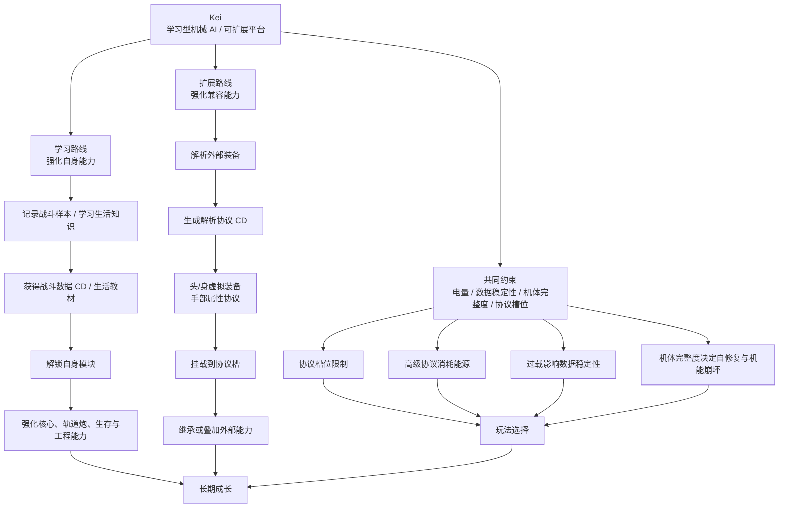
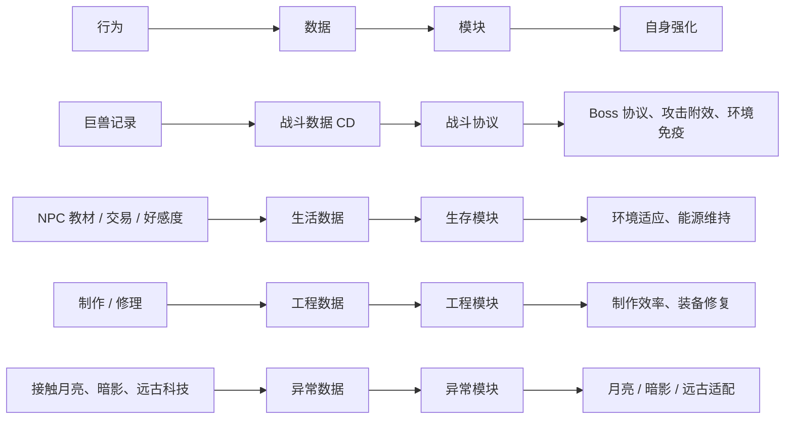
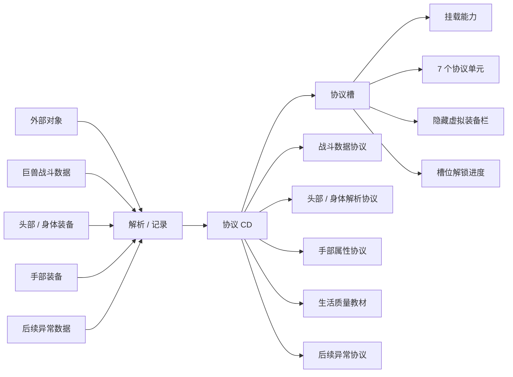
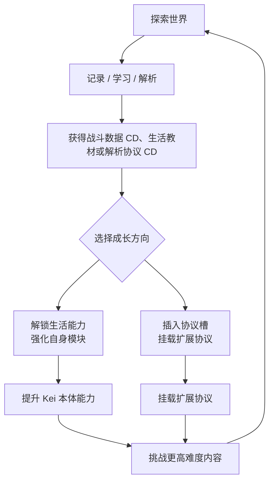

# Kei 初步设计图

状态：当前总设计图；三维方案、战斗数据记录器、生活数据学习、协议槽、解析协议和首批战斗协议已记录  
目标：定义 Kei 的角色设计方向、两条成长路线与核心玩法循环，并作为 Design 目录其他方案文件的总览入口。

## 一句话定位

Kei 是一个学习型机械 AI 角色。她的强度来自两件事：

- 学习路线：通过记录战斗样本、向 NPC 学习生活知识、分析世界规则，强化自身机体与算法。
- 扩展路线：通过协议槽挂载战斗数据 CD 与解析协议 CD，把外部能力转化为可切换协议。

她不是单纯依赖专属武器变强，而是逐步把世界转化为自己的兼容层。

## 总体设计图

## 两条成长路线

| 路线 | 核心问题 | 玩家体验 | 设计关键词 |
| --- | --- | --- | --- |
| 学习路线 | Kei 如何靠自己成长？ | 越战斗、越探索、越制作，机体越成熟 | 扫描、数据点、模块升级、弱点分析 |
| 扩展路线 | Kei 如何使用外部系统？ | 面对不同难度和模组环境，选择不同协议组合 | 扩展单元、虚拟装备栏、适配协议、角色联动 |

## 三维系统方案

Kei 的三维沿用 DST 底层组件，但表现层固定为 AI / 机器人状态。三维不是单纯改名，而是角色机制的一部分。

| 原版三维 | Kei 表现名 | 当前方案 |
| --- | --- | --- |
| 饱食度 | 电量 | 初始 120，按原版饱食度逻辑自然下降；普通食物吸收率为 20%。电量为 0 时移动速度降为 1/10，且移动时每秒损失 3 点机体完整度。 |
| San | 数据稳定性 | 初始 240，常态下不会自然变化，不受外界 sanity 光环影响。主要由协议运行、主动能力或后续特殊机制消耗 / 恢复。 |
| 血量 | 机体完整度 | 初始 180。高于最大值 5/6 时每 3 秒自动恢复 1 点；低于最大值 1/6 时每 3 秒降低 1 点。受损状态下移速降为 1/2，并提示“机体受损严重！需紧急修复”。 |

### 电量

- 电量替代饱食度，是 Kei 的基础运行资源。
- 初始电量为 120。
- 电量按原版饱食度逻辑自然下降。
- 普通食物只提供 20% 收益，避免 Kei 像普通生物一样依靠进食维持状态。
- 主要回复来源包括避雷针蓄电、薇诺娜发电机附近充电、便携电池、齿轮、电子元件和后续设计的能源类物品。
- 高级协议、轨道炮和自我修复都可以消耗电量。
- 电量为 0 时，Kei 移动速度降低为原来的 1/10，并且移动时每秒损失 3 点机体完整度。

### 数据稳定性

- 数据稳定性替代 San，数值越高代表逻辑越稳定，数值越低代表混乱越严重。
- 初始数据稳定性为 240。
- Kei 不受外界 sanity 光环影响，也不能通过普通食物恢复数据稳定性。
- 数据稳定性常态下不会自然变化。
- 睡觉、维护终端、整理数据、特定协议或专属维护道具可以恢复数据稳定性。
- 高稳定形态偏向精准计算、扫描效率和协议稳定运行；低稳定形态偏向错误协议、混乱输出或异常副作用。

### 机体完整度

- 机体完整度替代血量，表示 Kei 的机体损伤程度。
- 初始机体完整度为 180。
- 普通食物无法回复机体完整度，常规治疗手段应降低效果或不生效。
- 主要回复方式是修理工具、备用零件、专属维护道具和工程模块。
- 机体完整度高于最大值 5/6 时，Kei 每 3 秒自动恢复 1 点。
- 机体完整度低于最大值 1/6 时，Kei 每 3 秒降低 1 点。
- 当机体完整度表现为受损状态时，移动速度降低为原来的 1/2，并说话提示“机体受损严重！需紧急修复”。

## 学习路线思路图

## 扩展路线思路图

## 核心玩法循环

## 设计边界

- Kei 不直接“破解”或“强制装备”其他角色专属物品，而是用协议适配、虚拟装备、属性协议和兼容层来表达。
- 头部和身体解析协议优先通过隐藏虚拟装备栏继承原装备逻辑；手部解析协议只读取攻击力、位面伤害和移速倍率。
- 协议槽位是玩法选择的核心，不建议无限挂载所有能力。
- 平衡不是第一目标，但成本和限制仍然重要，因为它们能让角色有机器人系统感。
- 生活质量 CD 不进入协议槽；战斗数据 CD 和解析协议 CD 才是协议槽挂载对象。

## 后续细化顺序

1. 确定数据记录 CD、战斗数据 CD、协议单元和解析协议 CD 的代码名。
2. 实现数据记录器和力场流程。
3. 实现 7 个协议单元、自检和解锁进度保存。
4. 实现首批战斗数据协议：独眼巨鹿、熊獾、龙蝇。
5. 实现头部 / 身体解析协议的隐藏虚拟装备栏。
6. 实现手部解析协议的攻击力、位面伤害和移速加成。
7. 实现生活数据的三条 NPC 学习路线。
