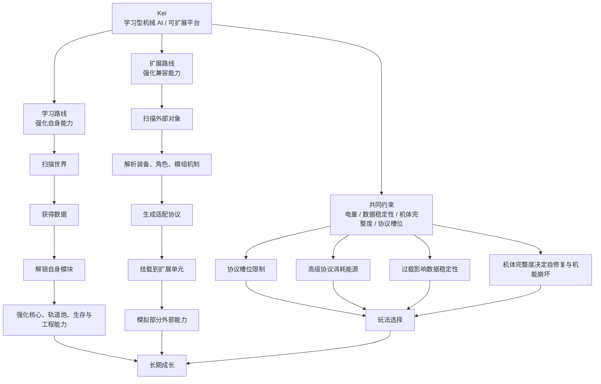
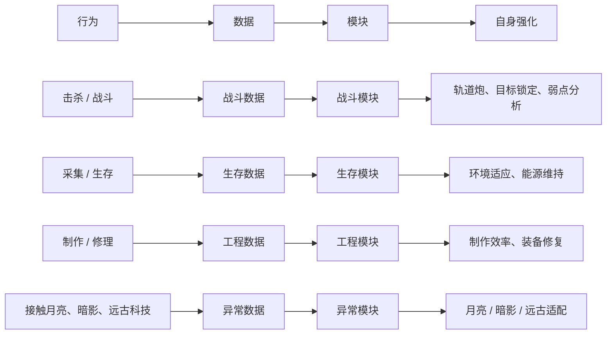
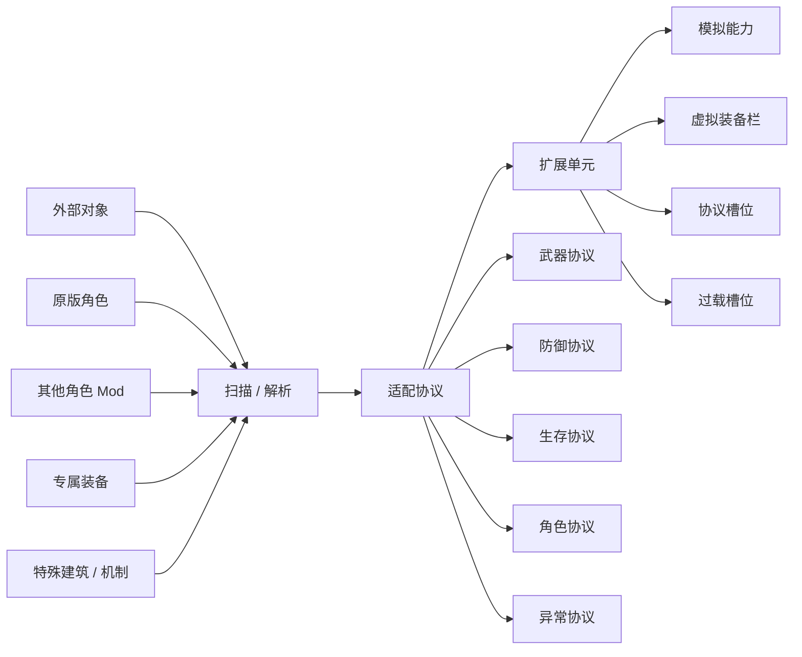
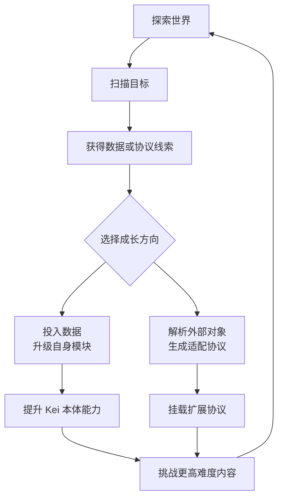

# Kei 初步设计图

状态：初版思路图；三维方案已固定  
目标：先定义 Kei 的角色设计方向、两条成长路线与核心玩法循环，不展开数值、配方、代码实现。

## 一句话定位

Kei 是一个学习型机械 AI 角色。她的强度来自两件事：

- 学习路线：通过扫描、记录、分析世界规则，强化自身机体与算法。
- 扩展路线：通过解析外部装备、角色能力与模组机制，挂载为自己的适配协议。

她不是单纯依赖专属武器变强，而是逐步把世界转化为自己的兼容层。

## 总体设计图

## 两条成长路线

| 路线 | 核心问题 | 玩家体验 | 设计关键词 |
| --- | --- | --- | --- |
| 学习路线 | Kei 如何靠自己成长？ | 越战斗、越探索、越制作，机体越成熟 | 扫描、数据点、模块升级、弱点分析 |
| 扩展路线 | Kei 如何使用外部系统？ | 面对不同难度和模组环境，选择不同协议组合 | 扩展单元、虚拟装备栏、适配协议、角色联动 |

## 三维系统方案

Kei 的三维沿用 DST 底层组件，但表现层固定为 AI / 机器人状态。三维不是单纯改名，而是角色机制的一部分。

| 原版三维 | Kei 表现名 | 当前方案 |
| --- | --- | --- |
| 饱食度 | 电量 | 普通食物吸收率降低，主要通过避雷针、薇诺娜发电机、便携电池、齿轮与电子材料等方式回复。电量用于维持协议、轨道炮和高阶模块运行。 |
| San | 数据稳定性 | 不受外界 sanity 光环影响，无法通过食物回复；随生存时间缓慢下降，通过睡觉、维护终端或整理数据类行为回复。高稳定与低稳定对应两种角色形态。 |
| 血量 | 机体完整度 | 无法通过普通食物回复，常规治疗效果降低或无效；通过修理工具、备用零件和专属维护物品回复。完整度较高时可自我修复，过低时失去自修复并进入机能崩坏，持续损伤直至修复或死亡。 |

### 电量

- 电量替代饱食度，是 Kei 的基础运行资源。
- 普通食物只提供很低收益，避免 Kei 像普通生物一样依靠进食维持状态。
- 主要回复来源包括避雷针蓄电、薇诺娜发电机附近充电、便携电池、齿轮、电子元件和后续设计的能源类物品。
- 高级协议、轨道炮、过载槽位和自我修复都可以消耗电量。

### 数据稳定性

- 数据稳定性替代 San，数值越高代表逻辑越稳定，数值越低代表混乱越严重。
- Kei 不受外界 sanity 光环影响，也不能通过普通食物恢复数据稳定性。
- 数据稳定性会随实际生存时间缓慢下降，表示长期运行带来的数据碎片和逻辑噪声。
- 睡觉、维护终端、整理数据、特定协议或专属维护道具可以恢复数据稳定性。
- 高稳定形态偏向精准计算、扫描效率和协议稳定运行；低稳定形态偏向错误协议、混乱输出或异常副作用。

### 机体完整度

- 机体完整度替代血量，表示 Kei 的机体损伤程度。
- 普通食物无法回复机体完整度，常规治疗手段应降低效果或不生效。
- 主要回复方式是修理工具、备用零件、专属维护道具和工程模块。
- 受损率较低时，Kei 可以消耗电量进行缓慢自我修复。
- 受损率过高时，自我修复停止，Kei 进入机能崩坏状态，逐渐失去机能并持续扣除机体完整度，直到修复或死亡。

## 学习路线思路图

## 扩展路线思路图

## 核心玩法循环

## 设计边界

- Kei 不直接“破解”或“强制装备”其他角色专属物品，而是用协议适配、模拟挂载、兼容层来表达。
- 外部扩展路线应该优先模拟部分能力，而不是一开始完整复制。
- 协议槽位是玩法选择的核心，不建议无限挂载所有能力。
- 平衡不是第一目标，但成本和限制仍然重要，因为它们能让角色有机器人系统感。
- 初版先确认系统关系，后续再展开数据分类、扫描规则、协议槽、角色联动和轨道炮细节。

## 后续细化顺序

1. 定义数据类型：战斗、生存、工程、异常、协议、适配。
2. 定义扫描对象：生物、Boss、装备、建筑、队友、专属物品。
3. 定义协议槽位：基础槽、升级槽、过载槽。
4. 定义两条路线的阶段成长。
5. 设计首批原版角色联动。
6. 设计通用 Mod 装备解析规则。
7. 设计轨道炮作为学习路线的代表性武器。
